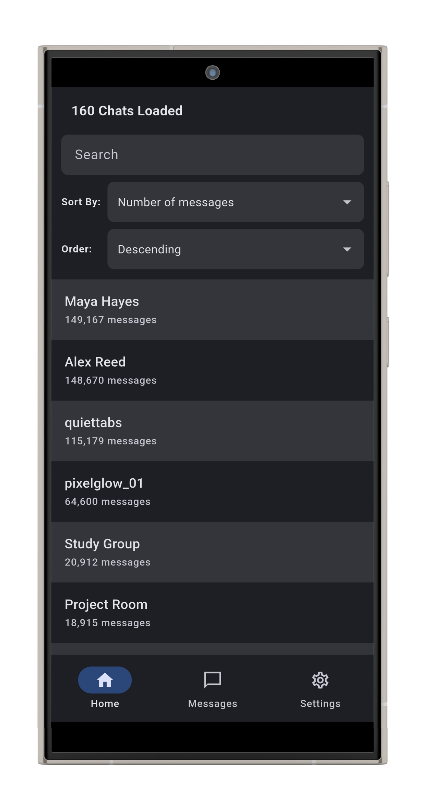
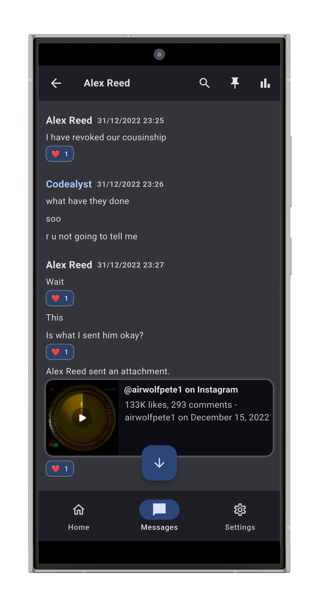
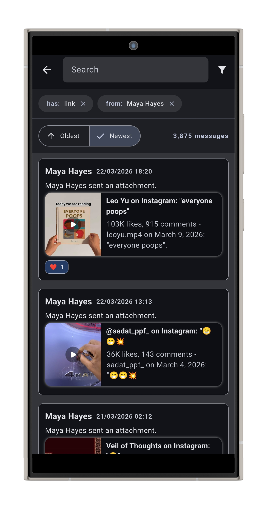
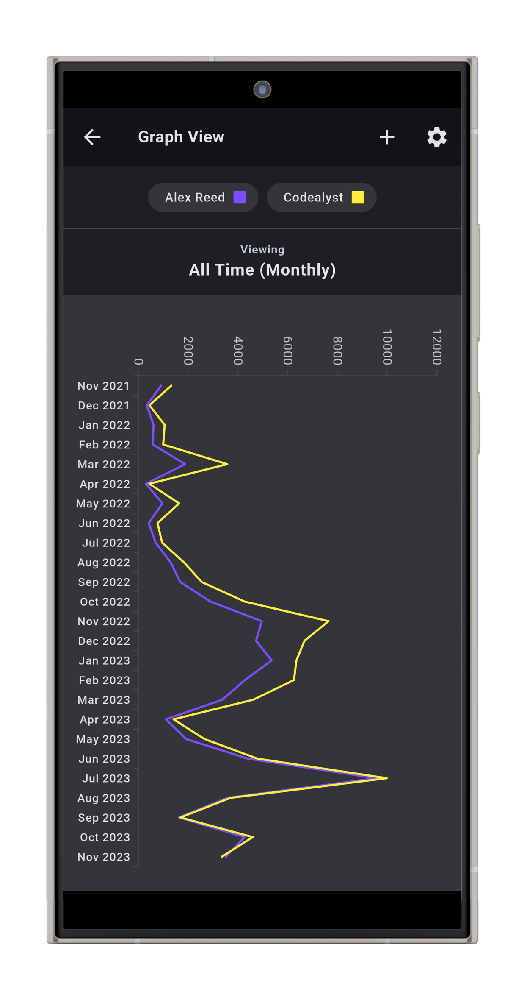

# Reminiscence

    

**Revisit your old Instagram messages with clarity, security, and nostalgia.**

Instagram lets you download an archive of all your messages. Reminiscence offers a better way to explore them by presenting your **Instagram data download** in a clean, searchable interface.

## 📸 Screenshots

| | |
|---|---|
|  |  |
|  |  |

## ✨ Features

- **Clean UI for Instagram Data:** Load your Instagram data download and explore messages through a beautiful interface.

- **Advanced Search:** Find messages by date, keywords, or attachment type. **Quickly jump to your very first message in any conversation.**

- **Conversation Analytics:** Discover the total number of messages in a chat. Visualize your message history in a graph.

- **Message Pinning:** Mark messages you want to revisit later by simply pinning them.

## 🔒 Privacy & Data Tools

- **Local Only:** Your Instagram data never leaves your device!

- **Encryption (Redundant):** Your Instagram data is encrypted while stored locally. This ensures if someone accessed your phone, your data would still be inaccessible. **This is redundant because the perpetrator can just access your Instagram.**

- **System Message Filtering:** Remove automated system messages like reactions or "liked a message" indicators for a cleaner viewing experience.

## 🛠️ Tech Stack

- **Frontend & App Logic:** Flutter
- **Secure Local Database:** SQLCipher

## 🗓️ Planned

### v26.07.1
- Change `.rem` file format for faster reading & writing speeds and consistency.

### v26.05.2
- For graphs, don't show people in earlier months if they have 0 messages.
- On bigger groups, graphs with separated participants dont show all the participants because they can't fit. Show the top participants in this case.
- For graphs, hard code the first 12 or 20 colours and the rest can be random.
- Fix graphs on deleted groups.
- Fix instagram reel previews (if possible)
- Test on older devices and optimize for lag.

## 🐛 Known Issues

- **Message Display:** Sometimes, messages don't appear and instead their index appears with an error.
- **Instagram Reel Preview:** Some instagram reels aren't previewed correctly and instead the login page appears, most likely due to bot detection and rate limiting by Instagram.
- **Multiple ZIP Files:** Combining zip files might not work correctly, can lead to missing or corrupted 
data in the REM file.
- **Graphs on Deleted Groups:** Might not render correctly and the participants won't all be shown (in separate participants mode).
- **Wrong Attachment:** The generated REM file may misconstrue what media file corresponds to what attachment and render the wrong one.

## ⚠️ Limitations
- **Stickers:** Instagram DYI does provides empty messages for stickers, therefore stickers cannot be rendered by the app.
- **Replies:** Instagram DYI does not reveal reply associations. Replies are indistinguishable from other messages.

## 📝 Changelog

### v26.05.1
- Migrated from semantic versioning to calendar versioning.
- Added: About tile in Settings for version number.
- Added: In-app updates.
- Added: "Leave a review" popups.
- Added: Built-in full-screen photo widget combined with the video widget to make a new media widget with zooming (for photos) and cycling through media attachments in the same message.
- Improved Quick Searches design.

### v1.1.2
- Scroll position of the chats list is saved when switching between it & a chat page.
- Added: Loading screen while a REM file is being exported.
- Fixed: Graph settings not fitting well in portrait mode.
- Fixed: Empty chats can now be handled without throwing an error.
- Fixed: Reminder notifications. 

### v1.1.1
- Added: Landscape mode.
- Moved the tutorial hyperlink to the top of the dialog.
- Recolored some UI elements.
- Added: Separate one-click and manual tutorials for the data download.
- Added: Warning that the data download could take up to 24 hours.
- Added: Quick searches ("First message", "Random message")

### v1.1.0
- Fixed: Reminiscence is no longer capable of opening ANY file type. This means `.rem` files can also no longer be opened through clicking on them (they must be loaded through the app).
- Added: Reminder notifications to return to the app.
- Updated: Instagram data download tutorial made simpler.

### v1.0.0
- Added: Generates REM files from Instagram data downloads.
- Completed: Messages display UI — Text, photos, videos, audio, files, reactions, link previews, etc..
- Completed: Graph UI.
- Completed: Pinned Messages.
- Completed: Search messages by keyword, date, chat, sender, and attachment type.
- Added: Filter automated system messages for cleaner conversations.
- Added: Mark messages as system messages manually.
- Added: Import/export app settings, including pinned and system-message preferences.
- Added: Optional password protection for .rem files, with all data kept on-device.
- Added: Instagram data download tutorial video.

## License

Copyright 2026 Codealyst.

The Reminiscence source code is licensed under the Apache License 2.0. See [LICENSE](LICENSE) for details.

The Reminiscence name, logo, app icon, screenshots, store listing materials, and other brand assets are not licensed for reuse without permission. Forks and redistributed builds must use different branding and clearly state that they are unofficial.
