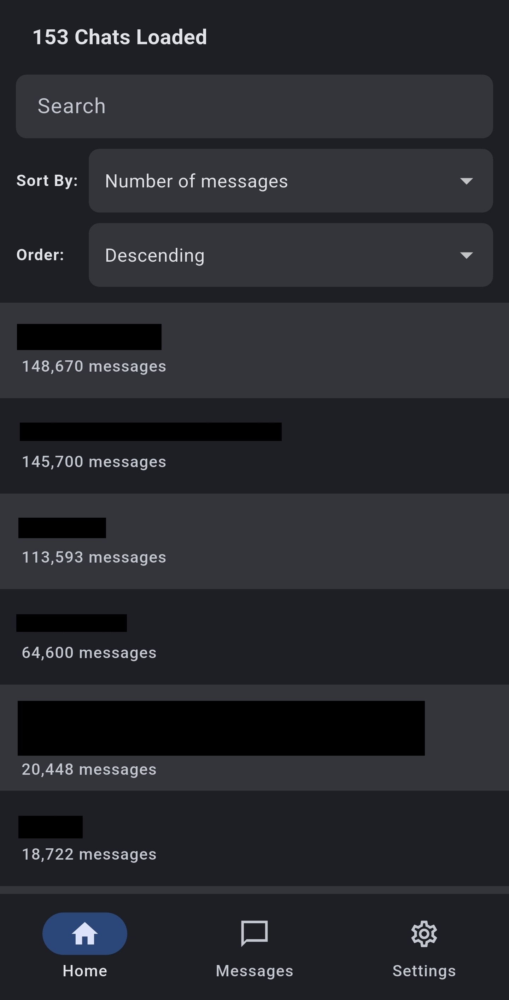
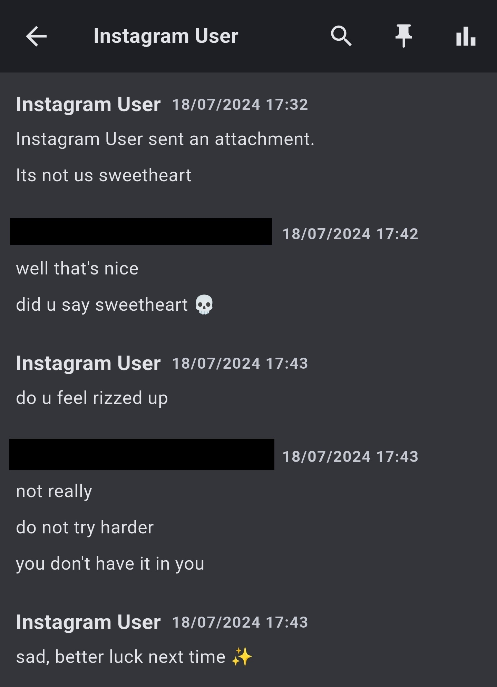
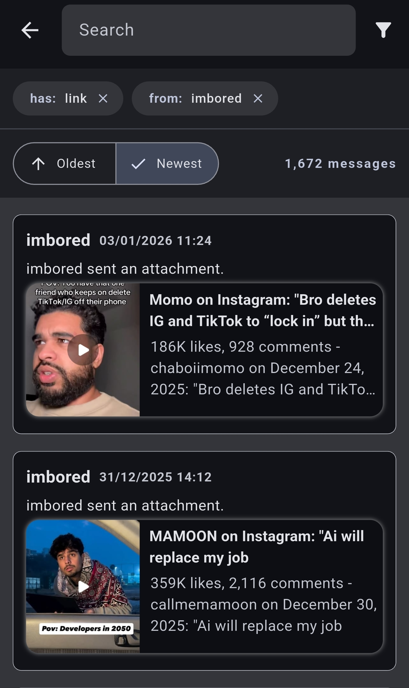
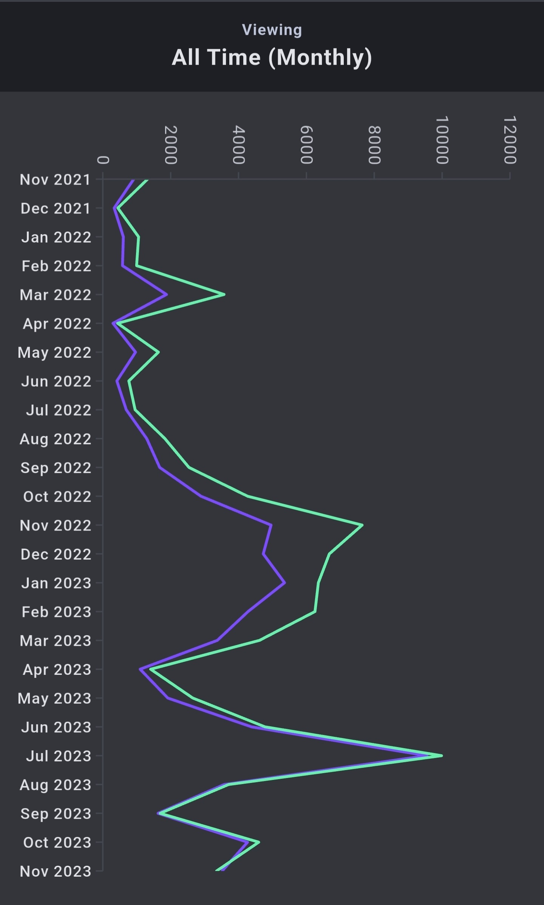

# Reminiscence

    

**Revisit your old Instagram messages with clarity, security, and nostalgia.**

Instagram lets you download an archive of all your messages. Reminiscence offers a better way to explore them by presenting your **Instagram data download** in a clean, searchable interface.

## 📸 Screenshots

    

    

    

    

## ✨ Features

- **Clean UI for Instagram Data:** Load your Instagram data download and explore messages through a beautiful interface.

- **Advanced Search:** Find messages by date, keywords, or attachment type. **Quickly jump to your very first message in any conversation.**

- **Conversation Analytics:** Discover the total number of messages in a chat. Visualize your message history in a graph.

- **Message Pinning:** Mark messages you want to revisit later by simply pinning them.

## 🔒 Privacy & Data Tools

- **Local Only:** Your Instagram data never leaves your device!

- **Encryption (Redundant):** Your Instagram data is encrypted while stored locally. This ensures if someone accessed your phone, your data would still be inaccessible. **This is redundant because the perpetrator can just access your Instagram.**

- **System Message Filtering:** Remove automated system messages like reactions or "liked a message" indicators for a cleaner viewing experience.

## 🛠️ Tech Stack

- **Frontend & App Logic:** Flutter
- **Secure Local Database:** SQLCipher

## 🗓️ Planned

### v1.1.0
- Fixed: Reminiscence is no longer capable of opening ANY file type. This means `.rem` files can also no longer be opened through clicking on them (they must be loaded through the app).
- Added: Reminder notifications to return to the app.
- Updated: Instagram data download tutorial made simpler.

## 🐛 Known Issues

- **Message Display:** Sometimes, messages don't appear and instead their index appears with an error.

## 📝 Changelog

### v1.0.0
- Added: Generates REM files from Instagram data downloads.
- Completed: Messages display UI — Text, photos, videos, audio, files, reactions, link previews, etc..
- Completed: Graph UI.
- Completed: Pinned Messages.
- Completed: Search messages by keyword, date, chat, sender, and attachment type.
- Added: Filter automated system messages for cleaner conversations.
- Added: Mark messages as system messages manually.
- Added: Import/export app settings, including pinned and system-message preferences.
- Added: Optional password protection for .rem files, with all data kept on-device.
- Added: Instagram data download tutorial video.
